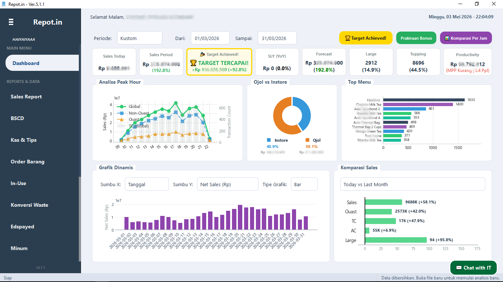
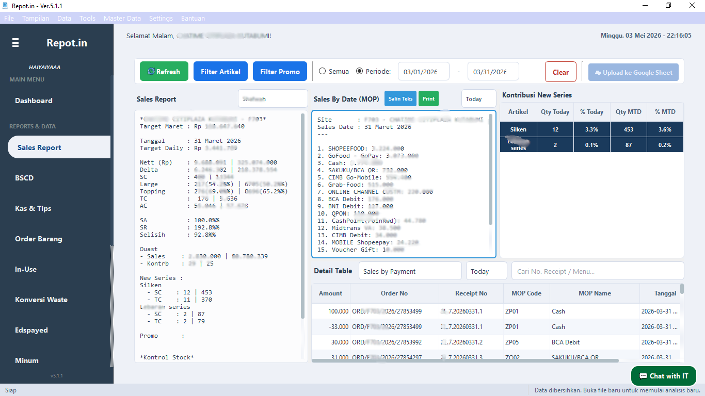
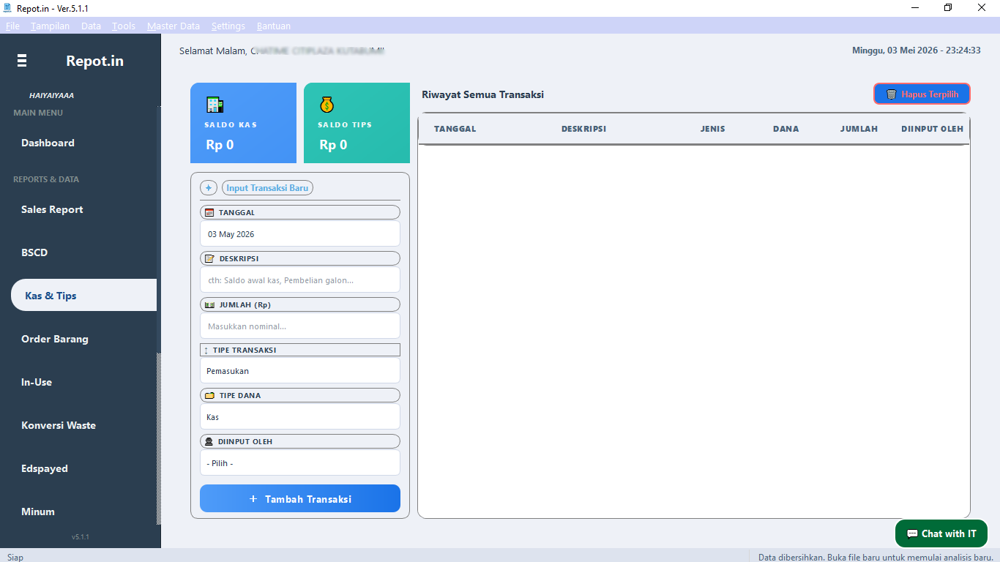

# Repot.in — No More Repot Reporting

<p align="center">
  
</p>

<p align="center">
  
  
  
  
  
</p>

> Aplikasi desktop manajemen dan analitik laporan penjualan harian untuk store yang menggunakan sistem POS backend **Aurora**. Repot.in menyederhanakan proses pelaporan dari input CSV mentah hingga laporan siap kirim, lengkap dengan dashboard real-time, analisis promo, dan banyak lagi.

---

## Fitur Utama

| Modul | Deskripsi |
|---|---|
| 📈 **Dashboard** | Ringkasan performa harian & MTD dengan indikator forecast vs. actuals |
| 📋 **Sales Report** | Generate laporan penjualan dari file CSV Aurora |
| 🔄 **Sync Aurora** | Scrape & download laporan langsung dari Aurora secara otomatis |
| 💰 **Kas & Tips** | Pencatatan kas masuk/keluar dan manajemen tips karyawan |
| 📦 **Order Barang** | Manajemen dan tracking order raw material ke warehouse |
| 🗑️ **Waste Conversion** | Konversi waste dan informasi budget waste |
| 🧾 **BPK Generator** | Buat, cetak & kelola Bukti Pengeluaran Kas (BPK) dalam format PDF otomatis |
| 📅 **Edspayed** | Kalkulator dan tracker tanggal expired produk |
| 💧 **Minum (Periode)** | Tracker jadwal pembelian air Galon karyawan |
| ☁️ **Upload Google Sheet** | Sinkronisasi data laporan ke Google Sheets |
| 📢 **Broadcast System** | Notifikasi dan pengumuman real-time dari developer |
| 📝 **Notes & Todo List** | Catatan dan daftar tugas internal |
| 💬 **Feedback** | Kirim laporan bug atau saran |

---

## Screenshots

<table>
  <tr>
    <td align="center"><br/><sub>Dashboard Utama</sub></td>
    <td align="center"><br/><sub>Sales Report</sub></td>
  </tr>
  <tr>
    <td align="center"><br/><sub>Kas & Tips</sub></td>
  </tr>
</table>

---

## Arsitektur Proyek

```
repot.in/
├── main_app.py              # Entry point & controller utama
│
├── modules/                 # Business logic & backend
│   ├── report_processor.py  # Pemrosesan data CSV & kalkulasi laporan
│   ├── database_manager.py  # SQLite local database (kas, tips, dll)
│   ├── order_db_manager.py  # Database order barang
│   ├── aurora_scraper.py    # Web scraper portal Aurora (PyQt WebEngine)
│   ├── config_manager.py    # Manajemen konfigurasi
│   ├── bpk_generator.py     # Generator PDF Bukti Pengeluaran Kas
│   ├── feedback_manager.py  # Pengiriman feedback
│   ├── workers.py           # QThread workers (file import)
│   ├── notification_manager.py
│   ├── broadcast_manager.py
│   ├── asset_manager.py
│   ├── chat_it_fetcher.py
│   └── validation_manager.py
│
├── ui/                      # Tampilan antarmuka
│   ├── ui_components.py     # Komponen UI utama
│   ├── dashboard_tab.py     # Tab Dashboard dengan grafik & KPI Cards
│   ├── sales_report_tab.py  # Tab laporan penjualan
│   ├── bpk_tab.py           # Tab manajemen BPK
│   ├── bpk_dialog.py        # Dialog cetak & pratinjau BPK
│   ├── order_tab_ui.py      # Tab order barang
│   ├── waste_conversion_tab.py
│   ├── minum_tab.py
│   ├── dialogs.py           # Dialog-dialog
│   ├── downloader_dialog.py
│   ├── feedback_dialog.py
│   ├── notes_dialog.py
│   └── todo_dialog.py
│
├── utils/                   # Utilitas & konstanta
│   ├── constants.py         # Konstanta global
│   ├── employee_utils.py    # Manajemen data karyawan & autentikasi
│   ├── chart_utils.py       # Utilitas pembuatan grafik
│   ├── app_utils.py
│   └── app_settings_utils.py
│
├── config/                  # File konfigurasi runtime
│   ├── app_settings.ini     # Konfigurasi utama aplikasi
│   ├── report_templates.json
│   ├── waste_recipes.json
│   ├── edspayed_data.json
│   └── placeholders.json
│
├── assets/                  # Aset statis
│   ├── images/              # Ikon, logo, splash screen
│   └── styles/              # Tema QSS (light & dark)
│
├── data/                    # Data runtime (SQLite, log, JSON)
├── downloads/               # File master data yang diunduh
├── requirements.txt         # Daftar dependensi Python
└── version.json             # Metadata versi untuk auto-update checker
```

---

## Cara Menjalankan (Development)

### Prasyarat

- Python **3.10+**
- Windows 10/11 (karena integrasi printer dan PyQt5 WebEngine)

### Instalasi

```bash
# 1. Clone repository
git clone https://github.com/jsteds/repot.in.git
cd repot.in

# 2. Buat virtual environment
python -m venv .venv
.venv\Scripts\activate

# 3. Install dependensi
pip install -r requirements.txt
```

### Menjalankan Aplikasi

```bash
python main_app.py
```

---

## Dependensi Utama

| Library | Kegunaan |
|---|---|
| `PyQt5` | Framework UI desktop |
| `PyQtWebEngine` | Web scraping Aurora via embedded browser |
| `pandas` | Pemrosesan dan analisis data CSV |
| `matplotlib` | Visualisasi grafik dashboard |
| `reportlab` / `fpdf2` | Generasi dokumen PDF (BPK) |
| `requests` | HTTP calls (feedback, broadcast, update check) |
| `openpyxl` | Baca/tulis file Excel (master data) |

> Untuk menginstal seluruh dependensi, gunakan perintah `pip install -r requirements.txt`.

---

## Konfigurasi Pertama Kali

1. **Jalankan aplikasi** → akan muncul dialog perjanjian EULA.
2. Buka menu **File → Konfigurasi** (Ctrl+,) untuk mengisi:
   - `Site Code` — kode outlet Anda
   - `Google Sheet ID` — untuk fitur upload laporan (opsional)
   - `Atur Target` — Atur target Bulanan dan Harian
3. Buka menu **File → Unduh File Online** untuk mengunduh asset pendukung (template, ikon, dll) dari server online.

---

## Alur Penggunaan Harian

```
1. Buka Repot.in
      ↓
2. Import Data:
   - [Otomatis] File → Sync Data Aurora  ← scrape langsung dari web Aurora
   - [Manual]   File → Import Data CSV   ← pilih file dari komputer
      ↓
3. Laporan otomatis di-generate di tab Sales Report
      ↓
4. Salin laporan → paste ke grup WhatsApp / media lain
      ↓
5. (Opsional) Upload ke Google Sheet via tombol ☁
```

---

## Fitur BPK (Bukti Pengeluaran Kas)

- Input nama karyawan, nominal, dan keperluan
- Generate PDF berformat A4 (emulasi continuous form)
- Dukungan printer: **Foxit PDF Reader**, **SumatraPDF**, atau printer sistem default
- Mendukung cetak ulang dengan pilihan printer

---

## Sistem Auto-Update

Aplikasi secara otomatis memeriksa versi terbaru melalui URL yang dikonfigurasi di `version.json`. Jika versi baru tersedia, notifikasi akan muncul dengan tautan dan install langsung dari aplikasi.

```
Versi Saat Ini: 5.1.1
URL Checker   : Google Drive (via version.json)
Download      : https://drive.google.com/drive/folders/1rwyOpgKzgOpoJvAG-b0yPxETG09O81ma
```

---

## Tema Antarmuka

Repot.in mendukung dua tema:

| Tema | Cara Aktifkan |
|---|---|
| Terang (Light) | Menu Tampilan → Tema Terang |
| Gelap (Dark) | Menu Tampilan → Tema Gelap |

File tema QSS dapat diunduh/diperbarui melalui fitur **Unduh File Online**.

---

## Feedback & Bug Report

Gunakan menu **Bantuan → Kirim Feedback / Lapor Bug** di dalam aplikasi. Feedback akan dikirim langsung dari aplikasi. Jika offline, data tersimpan secara lokal dan akan dikirim otomatis saat koneksi sudah pulih.

---

## Kontributor

- **[@jsteds](https://github.com/jsteds)** — Introvert Dev
- **[@e001red-coder](https://github.com/e001red-coder)** — also Me

---

## Lisensi

Proyek ini bersifat **privat** dan digunakan secara internal. Distribusi tanpa izin tidak diperkenankan.

---

<p align="center">
  Dibuat dengan ❤️ untuk memudahkan pekerjaan tim operasional citemmm :p -by jst eds
</p>
